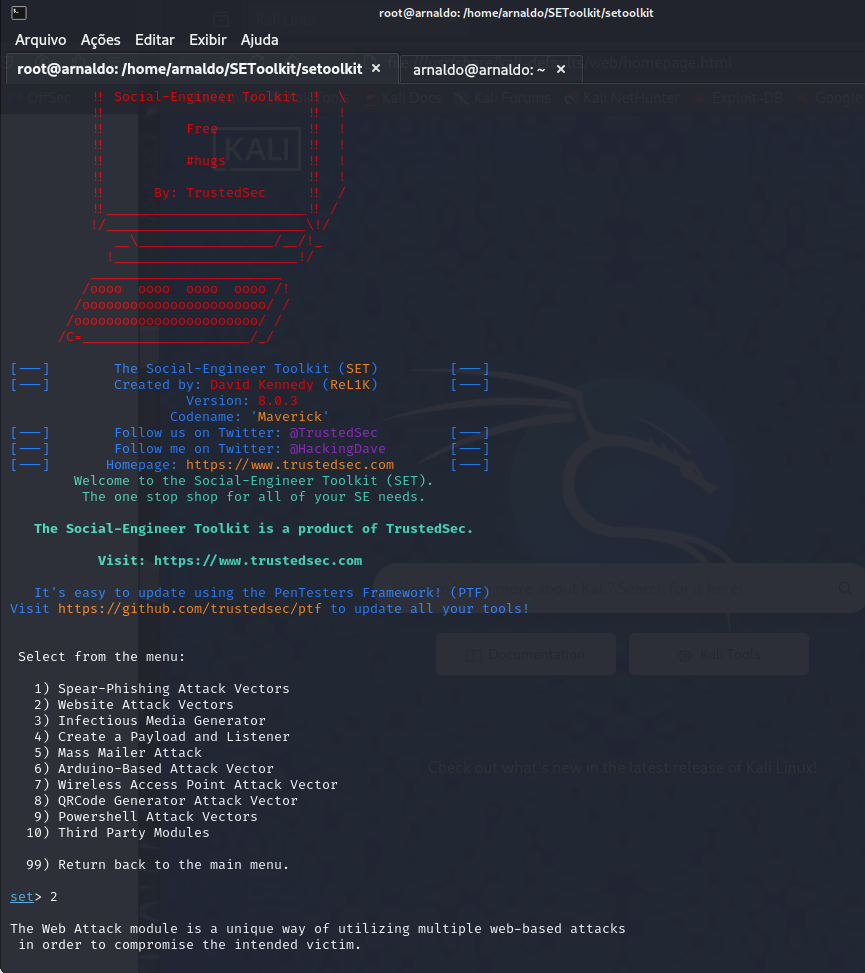
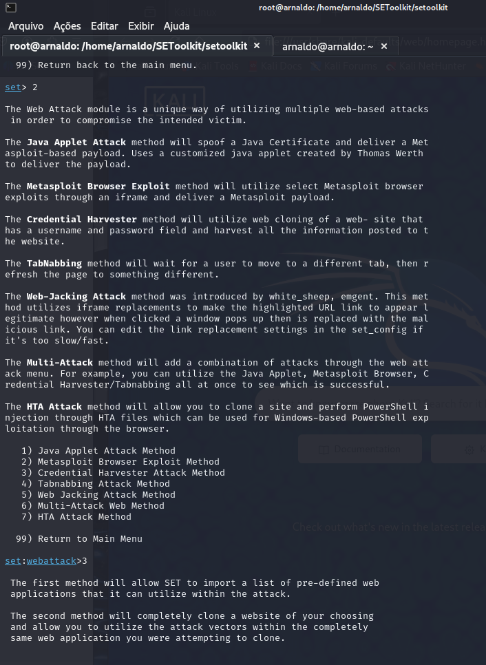
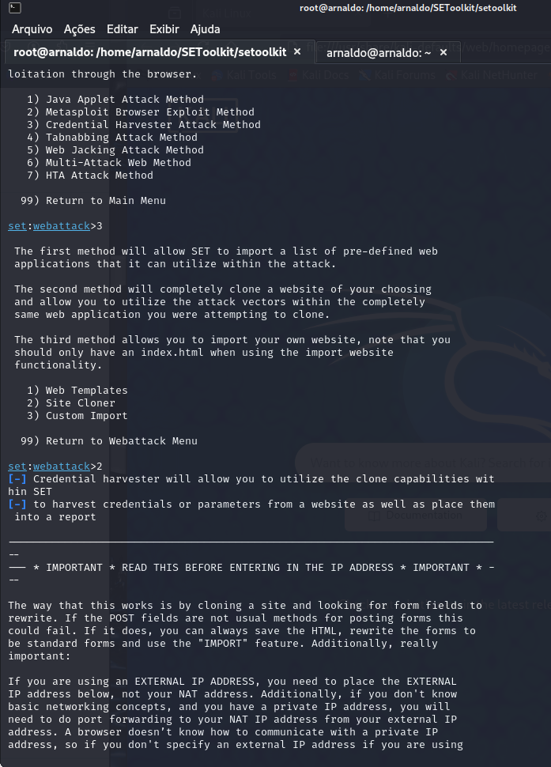
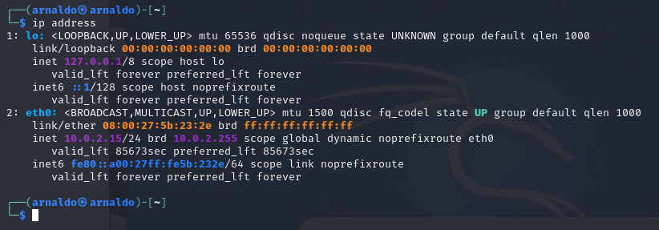
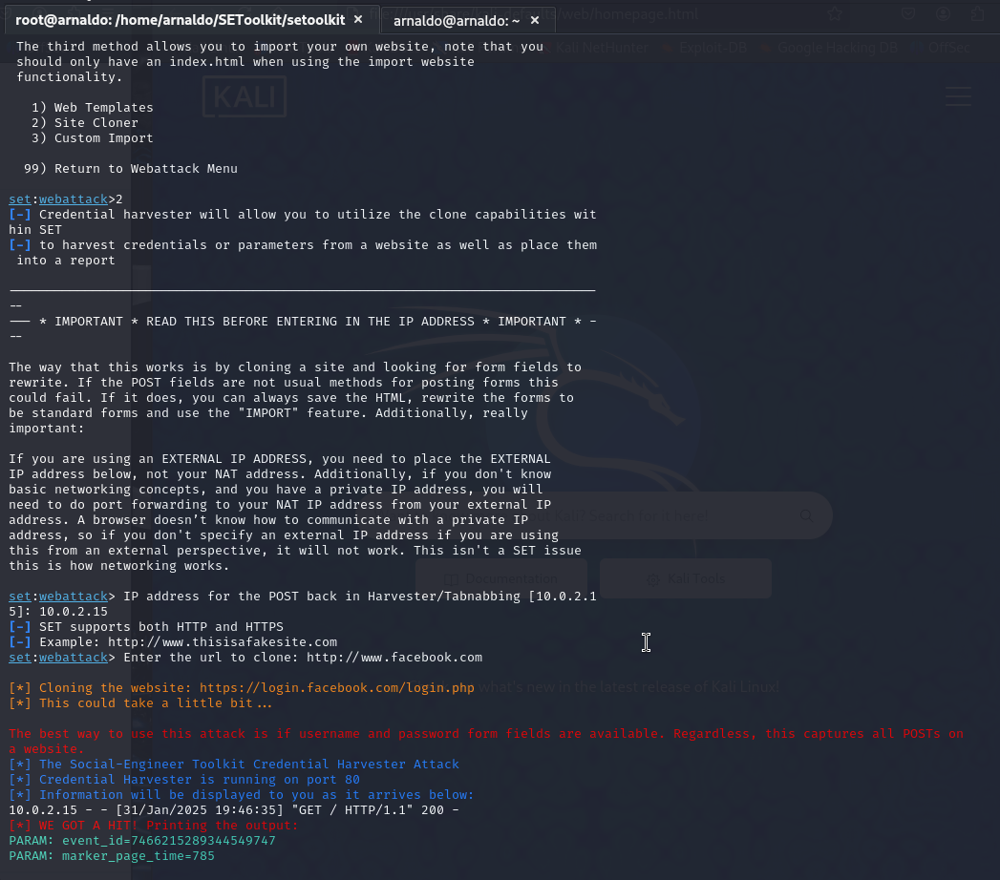
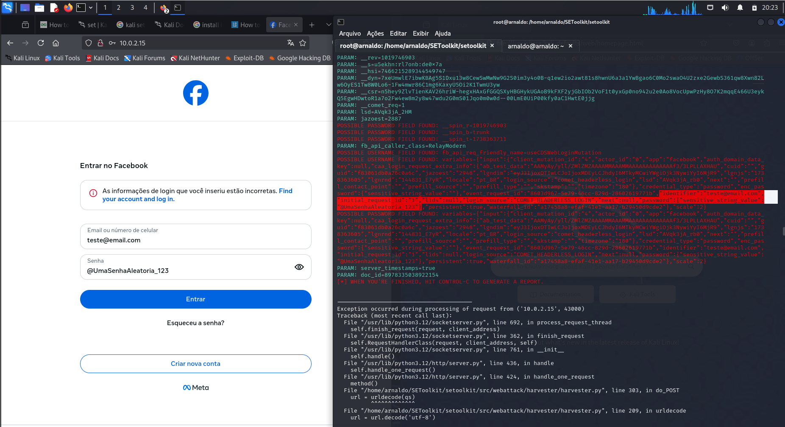

# Phishing para captura de senhas do Facebook

### Ferramentas

- Kali Linux
- setoolkit

### Configurando o Phishing no Kali Linux

- Acesso root: ``` sudo su ```
- Iniciando o setoolkit: ``` setoolkit ```
- Tipo de ataque: ``` Social-Engineering Attacks ```
- Vetor de ataque: ``` Web Site Attack Vectors ```
- Método de ataque: ```Credential Harvester Attack Method ```
- Método de ataque: ``` Site Cloner ```
- Obtendo o endereço da máquina: ``` ifconfig ```
- URL para clone: http://www.facebook.com

### Resutados
Abrir o Software SEtoolkit entrando na pasta em que ele foi baixado e executando 
o comando ./setoolkit.sh e verá a tela a seguir, nela escolher a opção 2:



Depois escolher a opção 3:



Então escolher a opção 2:



Em outro terminal executar o comando ip address para verificar o ip local:



Entrar com o ip obtido, teclar Enter, e depois colocar o endereço do site do Facebook
para ser clonado:



Passar o link com o ip malicioso para a "vítima" clicar, como pode ser visto no print a 
seguir, ao abrir o ip da máquina local, haverá uma réplica da tela de Login do 
Facebook, ao entrar com Usuário e senha e clicar em Entrar, é possível capturar os 
dados de acesso da vítima no payload no terminal.



